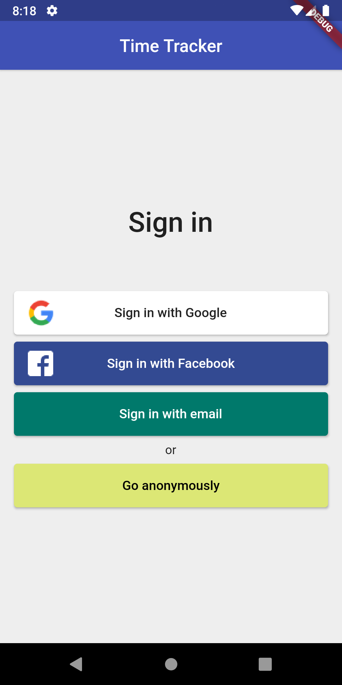
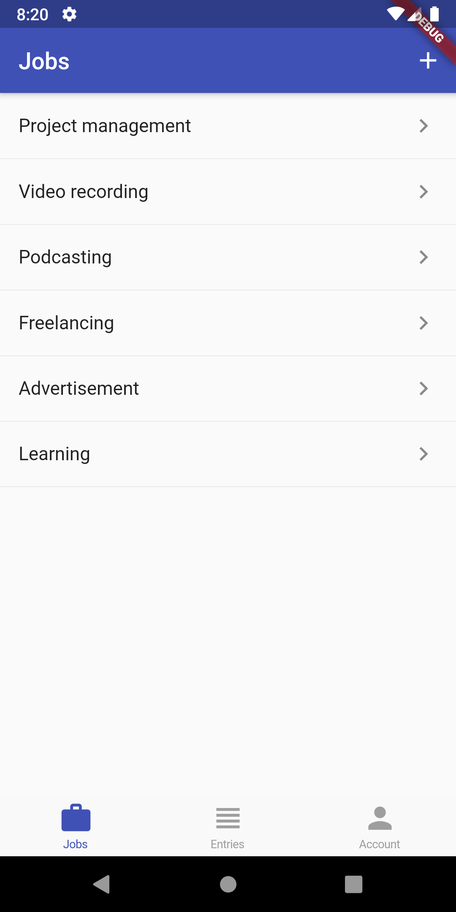
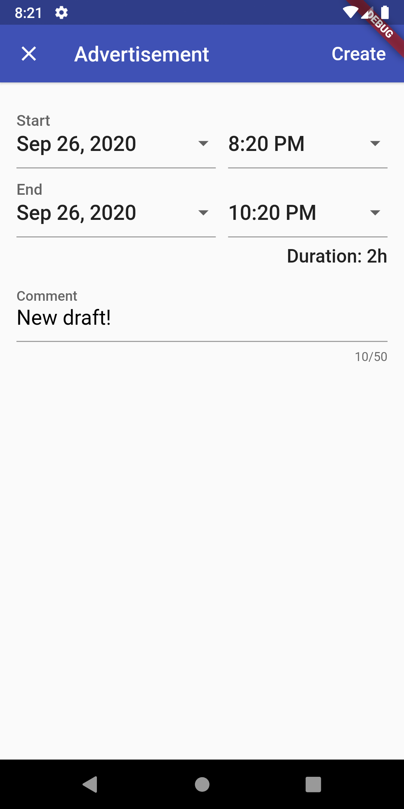
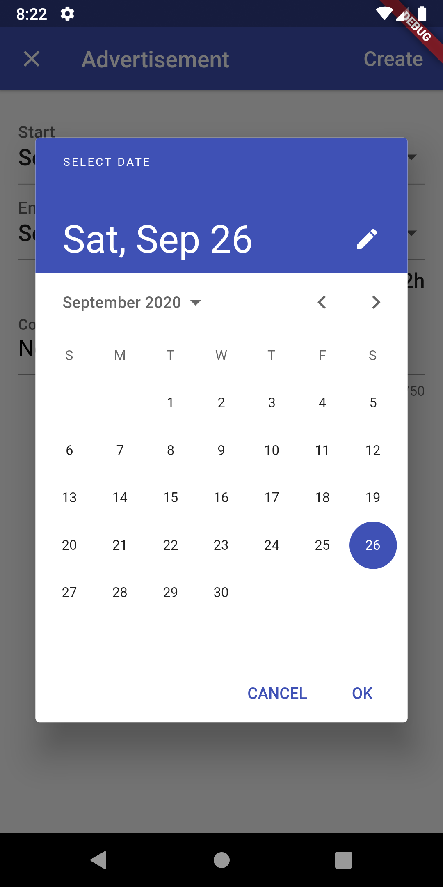
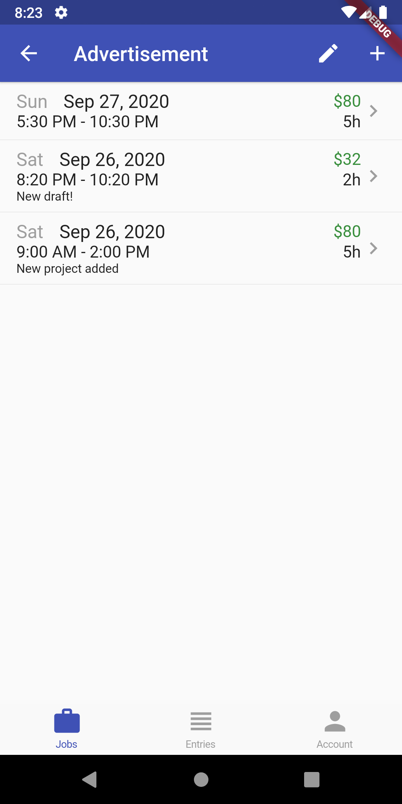
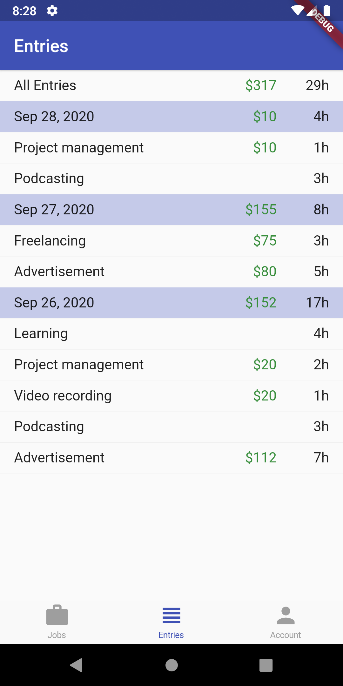

# Time Tracker

A Time Tracking application built using Flutter and Firebase.

## Features:

Ths project has several features:
- use the various Firebase sign-in methods
- build a robust authentication flow
- use appropriate state management techniques to separate UI, logic and Firebase authentication code using BLoC
- handle errors and present user-friendly error messages
- create, read, update and delete job data from cloud firestore
- showing different entries after transformation of data from Cloud firestore using RxDart

_Note: This project is made with the help of a Udemy course, for more click [here](https://www.udemy.com/course/flutter-firebase-build-a-complete-app-for-ios-android/)_

## Preview

 
<table><tr>
 <td style="text-align: center">
 
 </td>
 <td style="text-align: center">
 
 </td>
 <td style="text-align: center">
 
 </td>
 </tr></table>
 

 
 
<table><tr>
 <td style="text-align: center">
 
 </td>
 <td style="text-align: center">
 
 </td>
 <td style="text-align: center">
 
 </td>
 </tr></table>
 

